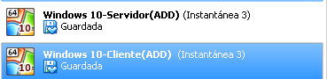

# Acceso Remoto VNC

<h2>1. Instalación en Windows</h2>

* Dos Máquinas Virtuales de Windows 10 una servidor y otra cliente.

<h3>1.1 Windows 10 Servidor</h3>

* Configuramos la IP del server.

* En la máquina server instalamos el programa *TightVNC Server*

* Una vez instalado, lo iniciamos, le ponemos una contraseña y lo configuramos.

* Ponemos un *Acces Control* con la ip del cliente para asegurarnos que este se va a poder conectar.

<h3>1.2 Windows 10 Cliente</h3>

* Configuramos la IP del cliente.

* En la máquina server instalamos el programa *TightVNC Viewer*

* Una vez instalado, lo iniciamos y nos intentamos conectar al servidor. Para ello ponemos la ip del servidor y la contraseña que establecimos.

* Comprobación

>comando netstat -n

<h2>2. Instalación en OpenSuse</h2>

* Dos Máquinas Virtuales de OpenSuse Leap una servidor y otra cliente.

<h3>2.1 OpenSuse Servidor</h3>

* Configuramos la IP del Servidor.

* En la máquina server activamos *VNC*

* Además en el cortafuegos hay que poner el servicio *VNC* como autorizado

* Creamos el server y ponemos una contraseña para conectarse a él

>Comando: vncserver

<h3>2.2 OpenSuse Cliente</h3>

* Configuramos la ip del Cliente.

* Al igual que en el server activamos *VNC*

* También en el cortafuegos hay que poner el servicio *VNC* como autorizado

* Nos intentamos conectar en el servidor poniendo la ip del servidor y la contraseña que pusimos antes.

>comando vncviewer

* Comprobación

>comando netstat -ntap

<h2>3. Conexión remota de Windows a OpenSuse</h2>

* Para esto necesitamos utilizar el Servidor en Opensuse mediante *VNC* y el Cliente en Windows mediante *TightVNC Viewer* (también VNC).Después ponemos en *TightVNC Viewer* la IP y el puerto de Opensuse, posteriormente la contraseña.

* Comprobación

>comando netstat -ntap

<h2>4. Conexión remota de OpenSuse a Windows</h2>

* Para esto nexesitamos utilizar el Servidor en Windows meadiante *TightVNC Server* y el Cliente en OpenSuse mediante *VNC*. Después ponemos en el OpenSuse cliente la IP del servidor Windows y la contraseña.

>utilizamos el comando vncviewer

* Comprobación

>comando netstat -n

